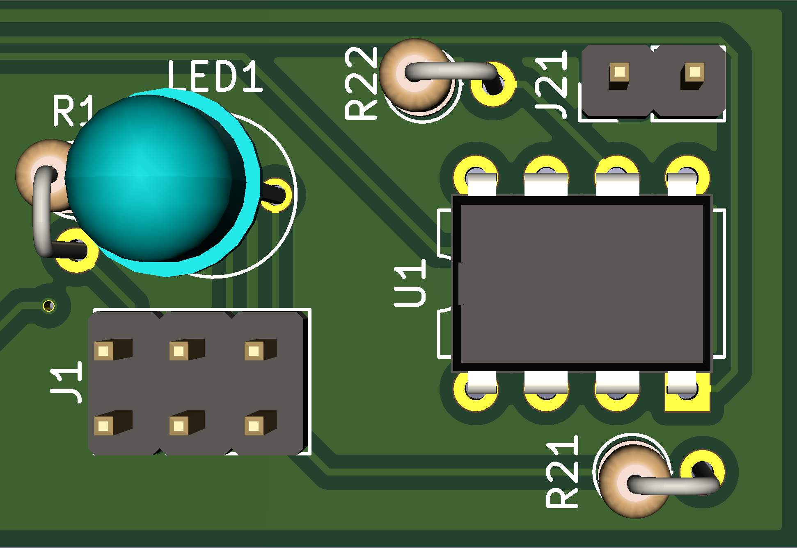
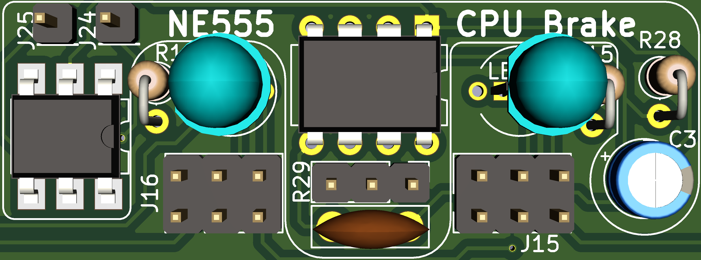
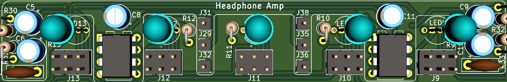

**This is still a WIP
**This has yet to be tested IRL. I currently don't have the funds to procure the PCB and parts in order to build and test it. No guarantee on anything as of yet. Also, the code for the Attiny85 has yet to be written, reason: See above.**
## Features

A PCB to enhance your C64C with various things:
- A Larson Scanner with RGB LEDs, so you can configure it to your liking!
- An Expansion Port reset circuit. You just need to connect a button and off you go!
- A CPU brake: Throttle your CPU and slow down your game during the really tricky bits!
- Mono & Stereo Headphone Amp. Listen to the beautiful SID sounds with your headphones. Either in mono or in stereo, if you have a dual SID!

## Assembly

After getting the PCB printed the the printing service of your choice and getting all the parts from the vendor of your choice, take a good look at [the interactive BOM](BOMinteractive.html).
It's a nice interactive overview of the whole PCB, which helps you placing all your parts where they're supposed to be! (You need to download )
Thanks to the Open Scope Project on GitHub for this amazing KiCad plugin: [InteractiveHtmlBom](https://github.com/openscopeproject/InteractiveHtmlBom)

## Connecting your LSC64

### Larson Scanner

For information about the pin layout of the power connector, check out: [C64 Power Supply Connector](https://www.c64-wiki.com/wiki/Power_Supply_Connector)

The bottom 3 pins of J1 to J20 are all the same. The top 3 pins of J1 to J20 represent one colour of the RGB LED each.
From left to right: red, blue green.
So, to set the colours of the LED:

| From                  | Of                   | To                        | Of                                                                                | Colour |
|:----------------------|:--------------------:|:-------------------------:|----------------------------------------------------------------------------------:|:------:|
| Any of J21            | LSC64                | Pin 5                     | [C64 Power Supply Connector](https://www.c64-wiki.com/wiki/Power_Supply_Connector)|        |
| J21                   | LSC64                | J24                       | LSC64                                                                             |        |
| J1 to J20 - Bottom Row| LSC64                | J1 to J20 - Top Left      | LSC64                                                                             | Red    |
| J1 to J20 - Bottom Row| LSC64                | J1 to J20 - Top Middle    | LSC64                                                                             | Blue   |
| J1 to J20 - Bottom Row| LSC64                | J1 to J20 - Top Right     | LSC64                                                                             | Green  |

**Caution: Enabling more than one colour may result in the LED not lighting up at all. That is due to the output capacity of the Attiny85.**

**I recommend you only have one colour per LED enabled at all times.**

Thanks to Luc Volders for the explanations and examples on how to build a charlieplexed Larson Scanner: [Luc's Tech Blog post about his Larson Scanner](https://lucstechblog.blogspot.com/2017/09/charlieplexing.html)

### The Reset Button

| From          | Of                   | To                        | Of                                |
|:--------------|:--------------------:|:-------------------------:|----------------------------------:|
| J22           | LSC64                | Pin C (RESET)             | [C64 Expansion Port](https://www.c64-wiki.com/wiki/Expansion_Port)|
| J27           | LSC64                | Pin 9 (EXROM)             | [C64 Expansion Port](https://www.c64-wiki.com/wiki/Expansion_Port)|
| J23           | LSC64                | Pin 1                     | [Button](https://www.digikey.de/product-detail/de/e-switch/RP3502MABLK/EG1932-ND/280450?cur=EUR&lang=de)|
| Any of J26    | LSC64                | Pin 2                     | [Button](https://www.digikey.de/product-detail/de/e-switch/RP3502MABLK/EG1932-ND/280450?cur=EUR&lang=de)|

For information about the pin layout of the power connector, check out: [C64 Expansion Port](https://www.c64-wiki.com/wiki/Expansion_Port)

Special thanks to AntaBaka for the schematics and the idea: [Expansionport-Deluxe-Reset](http://pitsch.de/stuff/c64/index_c64.htm#A24)

### CPU Brake

| From          | Of                   | To                        | Of                                |
|:--------------|:--------------------:|:-------------------------:|----------------------------------:|
| Pin 1         | On/Off Switch        | J21                       | LSC64                             |
| Pin 2         | On/Off Switch        | J24                       | LSC64                             |
| Terminal 1    | Dual Potentiometer   | Right Pin R29             | LSC64                             |
| Terminal 2    | Dual Potentiometer   | Middle Pin R29            | LSC64                             |
| Terminal 3    | Dual Potentiometer   | Left Pin R29              | LSC64                             |
| J25           | LSC64                | Pin 4                     | [C64 Expansion Port](https://www.c64-wiki.com/wiki/Expansion_Port)|

Special thanks to AntaBaka for the schematics and the idea: [CPU Brake NE555](http://pitsch.de/stuff/c64/index_c64.htm#A41)

### Mono-Stereo Headphone examples

##CAUTION
- **Boards with assembly no. 250469 have no VR1. Check beforehand!**
- **Stereo sound REQUIRES an [FPGA SID](https://webstore.kryoflux.com/catalog/product_info.php?cPath=27&products_id=63&language=en)!**

| From          | Of                   | To                        | Of                                |
|:--------------|:--------------------:|:-------------------------:|----------------------------------:|
| J31           | LSC64                | Pin 7 & 9                 | Rotary Switch                     |
| J29           | LSC64                | Pin 2                     | Dual Potentiometer                |
| J35           | LSC64                | Pin 12                    | Rotary Switch                     |
| J36           | LSC64                | Pin 5                     | Dual Potentiometer                |
| Pin 15 & 16   | Rotary Switch        | Pin 2                     | [VR1](images/Amp_Power_Supply.PNG)|
| Pin 1         | Dual Potentiometer   | Pin 3                     | [C64 A/V connector](https://www.c64-wiki.com/wiki/A/V_Jack)|
| Pin 4         | Dual Potentiometer   | Pin 7                     | [C64 A/V connector](https://www.c64-wiki.com/wiki/A/V_Jack)|
| Pin 3 & 6     | Dual Potentiometer   | Any of J26                | LSC64                             |
| J32           | LSC64                | Pin 13                    | Rotary Switch                     |
| J38           | LSC64                | Pin 14                    | Rotary Switch                     |
| Pin 1         | Rotary Switch        | Pin 2 (Tip) & Pin 3 (Ring)| Headphone Jack Mono               |
| Pin 1 (Sleeve)| Headphone Jack Mono  | Any of J26                | LSC64                             |
| Pin 3         | Rotary Switch        | Pin 2 (Tip)               | Headphone Jack Stereo             |
| Pin 6         | Rotary Switch        | Pin 3 (Ring)              | Headphone Jack Stereo             |
| Pin 1 (Sleeve)| Headphone Jack Stereo| Any of J26                | LSC64                             |

**Additional parts required but not listed in the InteractiveHtmlBom (They're not a physical part of the LSC64 PCB)**
- **4x3 rotary switch** (e.g.:[Symbol](images/Rotary_Switch4x3.PNG), [Datasheet Model A403](https://dznh3ojzb2azq.cloudfront.net/products/Rotary/A/documents/datasheet.pdf), [Product page](https://www.digikey.de/product-detail/de/c-k/A40315RNZQ/CKC7008-ND/181440)
- **dual potentiometer to change the volume** (e.g.:[Symbol](images/Dual_Potentiometer.PNG), [Datasheet](https://www.bourns.com/docs/Product-Datasheets/PDB18.pdf), [Product page](https://www.digikey.de/product-detail/de/bourns-inc/PDB182-K430K-104A/PDB182-K430K-104A-ND/3780721)).
- **Audio jack to plug in your headphones** (e.g.: [Datasheet](https://www.cuidevices.com/product/resource/sj1-351x.pdf), [Product page](https://www.digikey.de/product-detail/de/cui-devices/SJ1-3513/CP1-3513-ND/738683))

Special thanks to AntaBaka for the schematics and the idea [Headphone Amp Mono](http://pitsch.de/stuff/c64/index_amp.htm) and Minidisc.org for the stereo schematics [HeadBanger HEadphone Amp](http://www.minidisc.org/headbanger.html)
