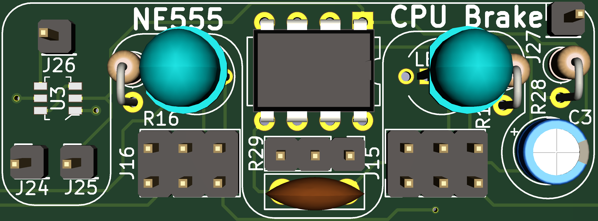

Larson Scanner C64C
-----

## Features

A PCB to enhance your C64C with various things:
- A Larson Scanner with RGB LEDs, so you can configure it to your liking!
- An Expansion Port reset circuit. You just need to connect a button and off you go!
- A CPU brake: Throttle your CPU and slow down your game during the really tricky bits!
- Headphone-jack mono and stereo. Listen to the beautiful SID sounds with your headphones. Either in mono or in stereo, if you have a dual SID

## Assembly

After getting the PCB printed the the printing service of your choice and getting all the parts from the vendor of your choice, take a good look at /Larscon SC64anner KiCad Files/bom/ibom.html.
It's a nice interactive overview of the whole PCB, which helps you placing all your parts where they're supposed to be!
Thanks to the Open Scope Project on GitHub for this amazing KiCad plugin: [InteractiveHtmlBom](https://github.com/openscopeproject/InteractiveHtmlBom)

## Connecting your LSC64

### The Reset Button

- Connect the top pin of J22 to pin C of the Expansion Port on your C64
- Connect the bottom pin of J22 to pin 9 of the Expansion Port on your C64
- Connect your switch to J23 and to pin 1 of the Expansion Port on your C64

For information about the pin layout of the power connector, check out: [C64 Expansion Port](https://www.c64-wiki.com/wiki/Expansion_Port)
Special thanks to AntaBaka for the schematics and the idea: [Expansionport-Deluxe-Reset](http://pitsch.de/stuff/c64/index_c64.htm#A24)

### Larson Scanner

- Connect the left pin of J21 to pin 5 of the C64 power connector
- Connect the right pin of J21 to pin 2 of the C64 power connector

For information about the pin layout of the power connector, check out: [C64 Power Supply Connector](https://www.c64-wiki.com/wiki/Power_Supply_Connector)

The bottom 3 pins of J1 to J20 are all the same. The top 3 pins of J1 to J20 represent one colour of the RGB LED each. 
From left to right: red, blue green.
So, to set the colours of the LED: 

- Red: Connect the bottom left pin to the top left pin. 
- Blue: Connect the bottom middle pin to the top middle pin.
- Green: Connect the bottom right pin to the top right pin.

**Caution: Enabling more than one colour may result in the LED not lighting up at all. That is due to the output capacity of the Attiny85.**
**I recommend you only have one colour per LED enabled at all times.**

Thanks to Luc Volders for the explanations and examples on how to build a charlieplexed Larson Scanner: [Luc's Tech Blog post about his Larson Scanner](https://lucstechblog.blogspot.com/2017/09/charlieplexing.html)

### CPU Brake

- On/Off-Switch: Connect one pin of your switch to pin 2 of the Expansion Port on your C64 and the other pin of your switch to pin J24
- Potentiometer: Connect terminal 1 to the right pin of R29, terminal 2 to the middle pin of R29, terminal 3 to the left pin of R29. For my german friends: Anfang an den rechten Pin von R29, Schleifer an den mittleren Pin und Ende an den linken Pin von R29
- Connect J26 to pin 1 of the Expansion Port on your C64
- Connect J25 to pin 4 of the Expansion Port on your C64

For information about the pin layout of the power connector, check out: [C64 Expansion Port](https://www.c64-wiki.com/wiki/Expansion_Port)
